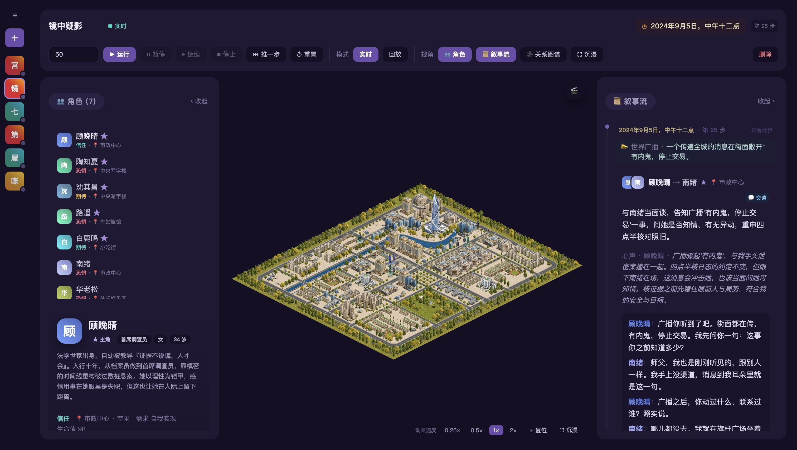
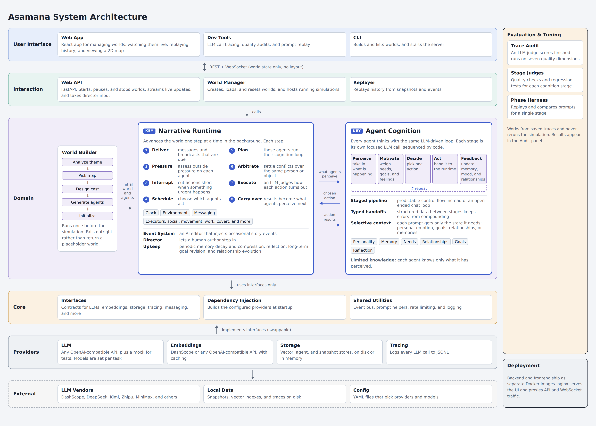

# Asamana

English | [简体中文](README.zh-CN.md)

[](https://github.com/dreamscroll-lab/asamana/actions/workflows/ci.yml) [](LICENSE)

<p align="center"></p>

▶️ **Demo video**: [watch on Bilibili](https://www.bilibili.com/video/BV1R4HS6WEsE/)

**Asamana is an AI-driven emergent narrative engine.**

Give Asamana a theme, and it creates a shared world with a cast of AI characters, each with a distinct persona and cognitive system. The characters act autonomously, and the story emerges from their interactions, with no script or predefined plot.

> **Status**: early development. APIs, configuration formats and save formats may change between releases. Backward compatibility is not yet guaranteed. See [CHANGELOG.md](CHANGELOG.md) for changes.

> **Language**: prompts and generated narratives, including dialogue and memories, are currently in Chinese.

## Philosophy: Treat AI characters as people

Model characters as people with personality, memory, emotions, needs and goals.

## Features

### 1. A human-inspired cognitive system for every character

Every character has personality, values, emotions, goals, needs, relationships and memories, along with the ability to reason, decide and act.

### 2. One world, one theme

Asamana keeps the cast in a bounded setting centered on **a single narrative theme**. This gives the emerging story focus and encourages meaningful interactions, conflict and memorable moments beyond everyday routines.

### 3. Designed as an agent loop, built as an orchestrated pipeline

Conversation-based agent loops accumulate context with each turn, increasing cost and diluting attention to relevant information. Asamana implements its cognitive loop as a pipeline using three techniques:

- **Staged orchestration**: cognition follows five stages, `perception → motivation → decision → action → feedback`, orchestrated deterministically in code. LLM calls within these stages can be tested and tuned independently, with explicitly assembled context.
- **Typed outputs**: stages exchange structured JSON through typed contracts. This makes outputs easier to validate and limits the spread of hallucinated information.
- **Shared context**: each stage receives the relevant persona, emotions, needs, goals, relationships, situation and recent memories to maintain consistency over time.

## Architecture

<p align="center"></p>

- **Backend** (Python): a single process serves the REST API and WebSocket updates, and runs the narrative engine as a background task. Strictly layered: `interaction → world / engine / agent → core ← providers`. Business logic depends only on the interfaces in `core/`, and infrastructure such as the LLM, embeddings, vector store and snapshots is pluggable.
- **Frontend** (React + Vite + TypeScript + Phaser): world management, live observation, replay and a 2D map. It communicates with the backend exclusively through the API; the engine is independent of rendering.
- **LLM access**: any OpenAI-compatible endpoint works out of the box, with no code changes, and different scenes can be routed to different models.
- **Deployment**: one image each for the frontend and backend, started with a single Docker Compose command.

```
interaction/   API (REST + WebSocket), replay, world management
world/         world building
engine/        runtime: clock, scheduling, environment, messaging, events, action execution
agent/         character cognition: personality, memory, needs, goals, relationships, decisions
providers/     pluggable infrastructure: LLM, embedding, vector store, snapshots
core/          interfaces, DI container, logging
config/        configuration (config.yaml is the default; presets/ holds per-vendor presets)
worlds/        world maps (Tiled maps + character art)
examples/      example worlds (imported on first start)
frontend/      React frontend
deploy/        Docker deployment
tuning/        developer tools for offline review and tuning
```

## Quick start

We recommend running Asamana on macOS. Docker with Compose v2 is required; see [Installing Docker](docs/deployment.md#installing-docker). Creating and running worlds requires API keys; browsing and replaying existing worlds does not.

```bash
git clone https://github.com/dreamscroll-lab/asamana.git && cd asamana
./deploy/asamana.sh start
```

On the first run, a setup wizard offers optional API key configuration (choose a model provider and enter its keys) and lets you enable developer tools. It writes `deploy/.env`, builds the images and starts the services. Open <http://localhost:8080/>, enter a theme, review and confirm the generated world, then run it to watch the story unfold.

The first start also imports two completed example worlds (the Xuanwu Gate Incident and a mystery about uncovering traitors), so you can browse and replay them without API keys.

### With and without keys

Configure all required API keys or leave them all unset. With a partial set, the backend refuses to start and lists the missing variables.

| | With keys | Without keys |
|---|---|---|
| Browse and replay existing worlds (map, characters, relationships, narrative feed) | ✅ | ✅ |
| Read-only developer tools (LLM call traces, audit reports, map workbench) | ✅ | ✅ |
| Create a world | ✅ | ❌ |
| Run, step, reset, director console | ✅ | ❌ |
| Developer tools that call a model (prompt replay, director console, audit/tuning runs, memory recall) | ✅ | ❌ |

Add or change keys at any time (this is also how you switch vendors):

```bash
./deploy/asamana.sh keys
```

If the backend is running, its container is rebuilt automatically with the new keys. Refresh the page to apply the changes in the UI. To repeat setup, run `./deploy/asamana.sh setup`.

> **Security note**: the API has no authentication. Anyone who can reach it can perform all API operations using your configured keys. The default deployment binds to localhost (`127.0.0.1:8080`). Add access controls before exposing it to a network. See [SECURITY.md](SECURITY.md).

Further reading:

- [Deployment](docs/deployment.md): Docker, deploying the frontend and backend separately, environment variables, data persistence
- [Configuration](docs/configuration.md): connecting LLM vendors, routing models by scene, embeddings
- [Development](docs/development.md): running locally, the command line, tests, developer tools
- [Observability and audit](docs/observability.md): LLM call tracing, narrative quality audits

## Tips

### Choosing a model

We recommend using one model family per world, although mixed configurations are supported:

| Goal | Recommended | Preset |
|---|---|---|
| Testing and debugging; speed and cost | DeepSeek | `config/presets/deepseek.yaml` |
| Balance of speed and narrative quality | Qwen | `config/config.yaml` (default) |
| Best narrative quality | GLM | `config/presets/zhipu.yaml` (Zhipu official) or `config/presets/dashscope_glm.yaml` (via Alibaba Cloud Model Studio) |

In our testing, Kimi was more expensive and tended toward abstract storytelling, while MiniMax followed JSON output requirements inconsistently and produced weaker narratives.

Alibaba Cloud Model Studio (DashScope) offers most leading open-weight models from Chinese vendors and some models from other vendors. It simplifies account management, but we haven't compared it with direct vendor endpoints for narrative quality, speed, concurrency, or request and token rate limits (RPM and TPM).

Use a larger model for world building to establish a strong narrative foundation. A smaller, faster model can reduce runtime costs.

### Token usage

Figures from 31 local runs (30–35 steps each, 6–8 characters, flash-tier models):

| Scope | LLM calls | Input tokens | Output tokens |
|---|---|---|---|
| World building (one-off) | ~10 | ~25k–35k | ~5k–10k |
| Running 35 steps · 6–8 characters | ~900–1,400 | ~2.4M–3.9M | ~150k–300k |
| **Total (one 35-step world)** | **~900–1,400** | **~2.45M–3.95M** | **~150k–300k** |

A 35-step world uses roughly **2.5M–4.2M tokens** in total, mostly input tokens. Usage varies with the number of characters, narrative activity and model. Prompts place stable content before variable context to maximize prefix cache hits, which can reduce costs with providers that offer discounted cached input.

> **Check your token budget before you start.** Each step makes several LLM calls per character, so usage grows linearly with the number of steps. The run page defaults to 50 steps; **leave the step count empty to run a single step**. To limit unintentional spending, there is no indefinite-run option. For longer runs, enter a larger step count; you can pause or stop at any time. We recommend that you:
>
> - estimate the cost from your model's pricing and the number of steps before you start, and make sure your balance or quota covers it;
> - set a usage alert or spending cap in your vendor's console;
> - start with a flash-tier model and a few steps, and only run longer stories once you've seen the results.

### Generated content

Every character, line of dialogue and plot point in a world is generated live by the LLM you connect. It doesn't reflect the views of the project's authors and may be inaccurate or inappropriate. Follow your model vendor's usage policies, and use your own judgment before sharing generated content publicly.

### Developer tools

Enable the developer tools for local development (see [Development](docs/development.md#developer-tools)), then open the `#/dev` page:

- **Trace**: the full record of every LLM call: prompt, response, tokens, latency and the stage it belongs to.
- **Audit**: uses an LLM to review a completed world's narrative quality. For routine reviews, use `mams` (the whole narrative), `sams` (each character's cognition) and `init` (world initialization).

## Acknowledgements

Asamana builds on the following work:

- **AgentSociety** (FIB Lab, Tsinghua University): Piao et al., [*AgentSociety: Large-Scale Simulation of LLM-Driven Generative Agents Advances Understanding of Human Behaviors and Society*](https://arxiv.org/abs/2502.08691), arXiv 2025.
  - **Need-driven motivation**: needs grounded in Maslow's hierarchy drive characters' goals and actions.
  - **Dual memory streams**: an objective event stream and a subjective experience stream are recorded separately and linked to each other. In Asamana these are the `FACTUAL` stream (what objectively happened in the world) and the `EXPERIENTIAL` stream (how the character subjectively understood it).
- **Generative Agents** (Stanford): Park et al., [*Generative Agents: Interactive Simulacra of Human Behavior*](https://arxiv.org/abs/2304.03442), UIST 2023.
  - **Memory retrieval by recency, importance and relevance**: memories are ranked by a weighted score across these three factors.
  - **Reflection**: recent experiences are distilled into higher-level insights that point back to the memories they are based on.

## Contributing

Issues and pull requests are always welcome. Please read [CONTRIBUTING.md](CONTRIBUTING.md) first.

## Citation

If you use Asamana in your research, see [CITATION.cff](CITATION.cff). GitHub's "Cite this repository" option provides a BibTeX citation.

## Contact

finley@dreamscroll.net (finley)

## License

[Apache License 2.0](LICENSE). The map and character art in `worlds/templates/` was created through a combination of AI generation and human editing and is also released under Apache-2.0.
